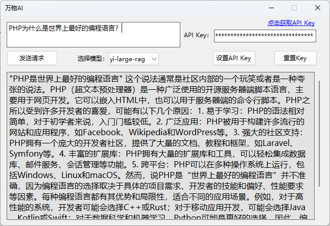

# Wanwu

**前端基于C# .Net Framework实现与零一万物平台的AI大模型对话**

[获取API Key](https://platform.lingyiwanwu.com/)

**平台简介**

零一万物 API 平台允许开发者将先进的自然语言处理能力集成到他们自己的应用程序中。通过这个平台，开发者可以利用 Yi 系列大模型的AI能力来执行各种任务，比如文本生成、语言翻译、内容摘要、逻辑推理、数学运算、编写代码等。

零一万物 API 平台提供灵活的调用方式，支持多种编程语言，并且可以根据需要定制功能，满足不同场景下的需求。无论是个人开发者还是企业开发者，都可以在这里解锁新的创新途径，提升用户体验，推动业务增长。

除此之外，零一万物API平台也提供了详细的文档和示例代码，帮助开发者快速上手并有效利用 Yi 系列大模型的能力。

**功能如图所示**

